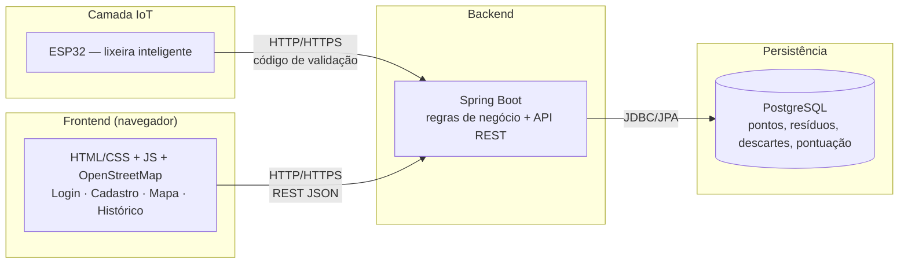

# Ecoflux — Diagramas de Projeto (UML)

Modelo de domínio, casos de uso e arquitetura do sistema **Ecoflux** (descarte inteligente de resíduos na UFRPE). Material derivado do Documento de Visão e das especificações diagramáticas da disciplina de Engenharia de Software.

## 1. Diagrama de Classes — modelo de domínio

### Usuário (abstract)

Classe-base abstrata que encapsula os dados comuns de qualquer utilizador do sistema:

| Atributo | Tipo |
| --- | --- |
| `id` | UUID |
| `código_usuario` | String |
| `email` | String |
| `nome` | String |
| `data_nascimento` | Date |
| `senha` | String |

### Especializações de Usuário

#### Funcionário

Perfil responsável pela **gestão operacional da infraestrutura** (pontos, lixeiras e pedidos de limpeza).

- `consultarSolicitacoes(): List<SolicitacaoLimpeza>`
- `adicionarPontoDescarte(PontoDescarte): void`
- `removerPontoDescarte(UUID): void`
- `adicionarLixeira(LixeiraEletronica): void`
- `removerLixeira(UUID): void`

#### Colaborador

Perfil de utilizador final que efetua os descartes e **acumula pontuação**.

- `consultarPontosDescarte(): List<PontoDescarte>`
- `consultarPontuacao(): int`
- `consultarHistorico(): List<Descarte>`

### Infraestrutura e equipamento

#### Ponto de Descarte

| Atributo | Tipo |
| --- | --- |
| `id` | UUID |
| `nome` | String |
| `descricao` | String |
| `latitude` | double |
| `longitude` | double |
| `ativo` | boolean |

Relação de **composição** (losango preenchido) com Lixeira Eletrônica: as lixeiras pertencem fisicamente ao ponto e dependem da sua existência.

#### Lixeira Eletrônica

| Atributo | Tipo |
| --- | --- |
| `id` | UUID |
| `identificacao` | String |
| `enderecoIP` | String |
| `ativa` | boolean |
| `ultimaComunicacao` | DateTime |
| `local` | PontoDescarte |

Métodos:

- `iniciarDescarte(): void`
- `selecionarResiduo(tipo: TipoResiduo): void`
- `solicitarCodigo(): CodigoDescarte`
- `enviarCodigo(): void`
- `confirmarDescarte(): void`
- `verificarConexao(): boolean`
- `verificarNivel(): boolean`
- `solicitarLimpeza(lixeira: LixeiraEletronica): void`
- `confirmarLimpeza(): void`

### Processamento de descarte e limpeza

#### Tipo de Resíduo («enumeration»)

`ORGANICO`, `METAL`, `PAPEL`, `PLASTICO`, `VIDRO`, `CONTAMINADO`.

#### Descarte

| Atributo | Tipo |
| --- | --- |
| `id` | UUID |
| `colaborador` | Colaborador |
| `lixeira` | LixeiraEletronica |
| `dataHora` | LocalDateTime |
| `pontos_obtidos` | int |
| `tipo` | TipoResiduo |

Relações: associa-se a Colaborador (0..* para 1); associa-se a Lixeira Eletrônica (0..* para 1); recebe exatamente 1 Tipo de Resíduo.

#### Código Descarte («transient»)

| Atributo | Tipo |
| --- | --- |
| `id` | UUID |
| `codigo` | String |
| `lixeira` | LixeiraEletronica |
| `criadoEm` | LocalDateTime |
| `expiraEm` | LocalDateTime |

Objeto **efémero** de autenticação/validação entre Colaborador (1), Lixeira Eletrônica (1) e o registo de Descarte (0..* para 1).

#### Solicitação de Limpeza

| Atributo | Tipo |
| --- | --- |
| `id` | UUID |
| `lixeira_id` | UUID |
| `data` | LocalDateTime |
| `status` | boolean |

Relações: liga-se à Lixeira Eletrônica (0..* solicitações por lixeira); liga-se ao Funcionário (0..* solicitações tratadas/consultadas).

### Resumo do fluxo do sistema

1. **Gestão:** o Funcionário cria e monitoriza Ponto de Descarte e Lixeira Eletrônica.
2. **Utilização:** um Colaborador aproxima-se de uma Lixeira Eletrônica e obtém um Código Descarte temporário.
3. **Registo:** ao concluir a ação, é gerada uma instância de Descarte com o respetivo Tipo de Resíduo e os pontos ganhos.
4. **Manutenção:** se a lixeira atingir a capacidade máxima (`verificarNivel()`), é disparada uma Solicitação de Limpeza, gerida por um Funcionário.

## 2. Diagrama de Casos de Uso

### Atores

| Ator | Descrição |
| --- | --- |
| **Colaborador** | Utilizador comum: conta pessoal, reciclagem e acompanhamento das atividades. |
| **Lixeira Eletrônica** | Ator dispositivo/sistema externo que interage com a plataforma para registo e pedidos de manutenção. |
| **Funcionário** | Perfil operacional: manutenção física das lixeiras e gestão dos pontos de recolha. |

### Casos de uso por ator

#### Colaborador

- **Consultar Pontos de Descarte** — localizar e visualizar os pontos de recolha disponíveis.
- **Cadastro** — criação do registo/perfil na plataforma.
- **Login** — autenticação de acesso ao sistema.
- **Consultar Pontuação** — saldo de pontos acumulados.
- **Consultar Descartes** — histórico de descartes executados.
- **Realizar Descarte** — interação partilhada com a Lixeira Eletrônica.

#### Lixeira Eletrônica

- **Realizar Descarte** — participa do processo conjunto com o Colaborador para validar e efetivar o descarte.
- **Solicitar Limpeza** — alerta/pedido de esvaziamento ou higienização quando necessário (ex.: capacidade máxima).

#### Funcionário

- **Consultar Solicitação de Limpeza** — lista de pedidos emitidos pelas lixeiras.
- **Realizar Limpeza** — execução da tarefa física de esvaziamento/higienização.
- **Adicionar Ponto de Descarte** — nova localização física para contentores.
- **Remover Ponto de Descarte** — exclusão de uma localização do sistema.
- **Adicionar Lixeira** — vinculação/configuração de nova lixeira eletrónica.
- **Remover Lixeira** — desativação ou remoção de lixeira existente.
- **Consultar Pontos de Descarte** — consulta informativa para gestão e supervisão.

## 3. Arquitetura de software e infraestrutura

### Camada IoT

- **Tecnologia:** ESP32.
- **Responsabilidade:** interação direta do utilizador com a lixeira inteligente.
- **Comunicação:** HTTP/HTTPS com o backend, enviando o fluxo **"Código de Validação"** para autenticação e validação das operações de descarte.

### Camada Frontend

- **Tecnologia:** HTML/CSS + JavaScript + OpenStreetMap.
- **Responsabilidade:** interface com o utilizador — Login, Cadastro, Mapa (OpenStreetMap) e Histórico.
- **Comunicação:** HTTP/HTTPS consumindo API REST com tráfego em JSON.

### Camada Backend

- **Tecnologia:** Java (Spring Boot).
- **Responsabilidade:** regras de negócio, integração e gestão do acesso ao módulo IoT e à base de dados.
- **Conexão com BD:** JDBC/JPA (mapeamento objeto-relacional e operações de persistência).

### Camada de Base de Dados

- **Tecnologia:** PostgreSQL.
- **Responsabilidade:** armazenamento persistente — entidades de Pontos de Coleta, Resíduos, Descartes e Pontuação.

